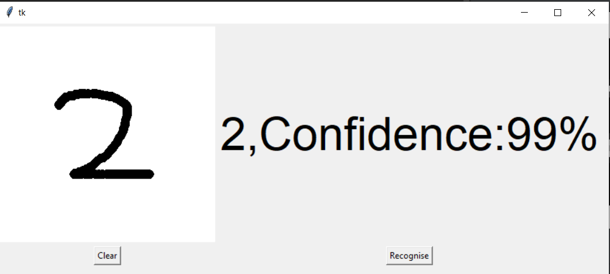
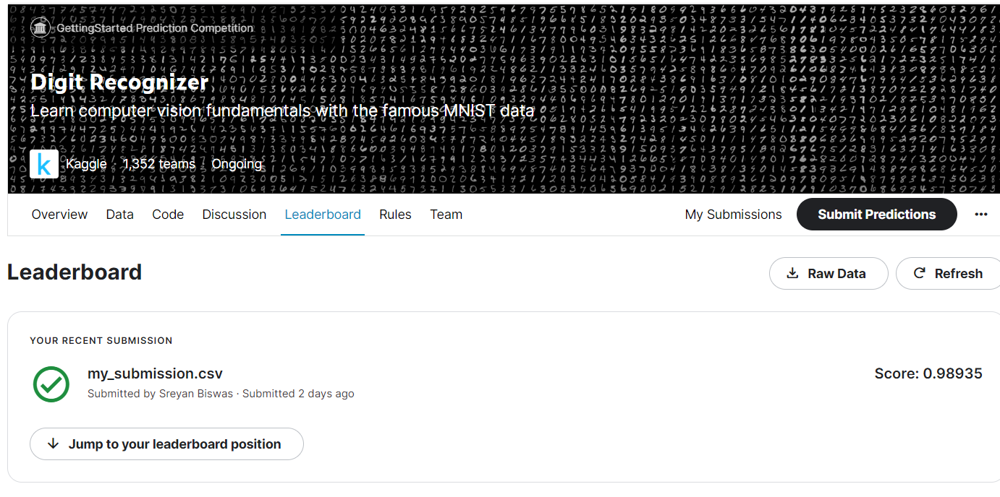

# MNIST Digit Recognizer

In this data science and Deep Learning project, we implement a Convolutional Neural Network(CNN) model to recognise and predict labels for handwritten digits using the MNIST dataset.
**Required libraries**: NumPy, Pandas, Matplotlib, Scikit learn, Pickle,Tensorflow,Keras, Tkinter, Pillow

**Technologies used in this project:**

1. Python
2. Numpy for feature scaling
3. Matplotlib for data visualization
4. Tensorflow for model building
5. Sklearn for Cross Validation
6. Jupyter notebook, Visual Studio Code and PyCharm as IDE

**Folder structure:**

- Kaggle : This folder contains the code and data to be used for kaggle competion submission

**Description of the files present in the directory:**

- Code for model generation.ipynb: Contains the code for loading the dataset,training the model, generating the model pickle file.
- final_model.h5: Generated model pickle file
- GUI.py: Compiling this file displays a GUI App to allow the user to draw the digit and use the trained model for prediction
- Model_generator.py: Compiling this file Generates the model pickle file by loading the MNIST Dataset and training the model
- Model_tester.py: Compiling this file uses the saved model pickle file and predicts the output label by taking 'sample_image.png' as the input image
- snapshot.png: Screenshot of the GUI App developed

### How to use the model to make predictions?

**Method 1: Using the Jupyter Notebook only**

1. Run the code present in "Model_generator.ipynb" Jupyter notebook. This loads the MNIST Dataset,trains the defined CNN model and then saves the model in a pickle file.
2. The trained model is tested on a sample image 'sample_image.png' and the predicted label is displayed
3. Then the GUI App opens automatically. Draw digits in the defined white canvas.
4. Press the 'Recognise' button to display the predicted label.

**Method 2: Running modules seprately**

1. Run the file 'Model_generator.py' using any Python IDE. This generates the model pickle file by loading the MNIST Dataset and training the model.
2. Run the file 'Model_tester.py'. Compiling this file uses the saved model pickle file and predicts the output label by taking 'sample_image.png' as the input image
3. Run the file 'GUI.py'. Compiling this file displays a GUI App to allow the user to draw the digit and use the trained model for prediction

**Note:** Do not move the GUI App window. This is will lead to errors in prediction. The default location of the GUI App is the centre of the screen and it loads automatically.

### How to use the generated model to make a submission in Kaggle?

1. Navigate to the folder 'Kaggle'. This folder contains the training dataset(train.csv) provided by Kaggle.
2. Run the Jupyter Notebook 'kaggle_prediction_generator.ipynb'. This loads the dataset into the model and then generates the prediction file 'my_submission.csv' by making predictions on the Test set 'test.csv'
3. Submit this 'my_submission.csv' at the Kaggle Competition: https://www.kaggle.com/competitions/digit-recognizer

## GUI Snapshot

  

## Kaggle submission Snapshot

  
